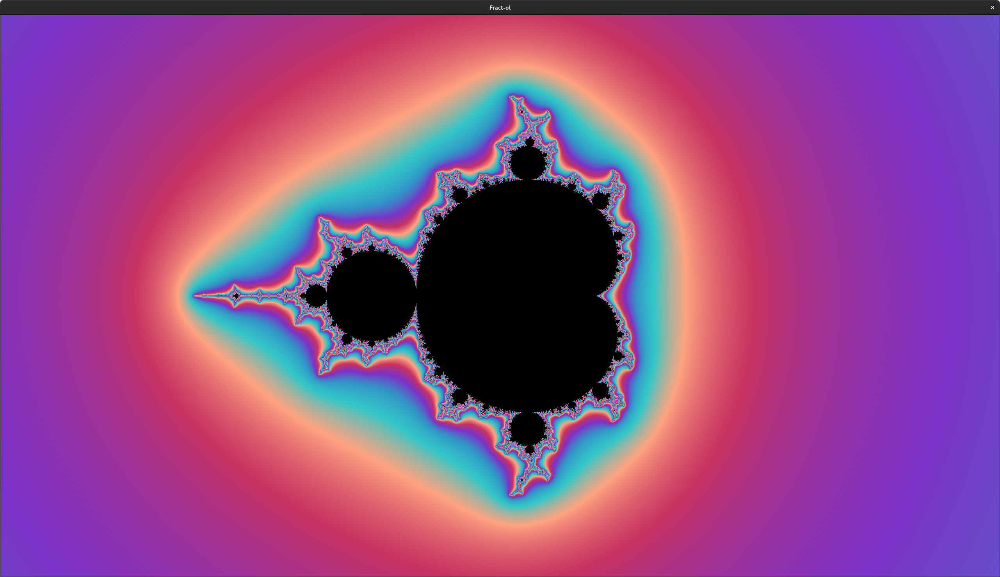
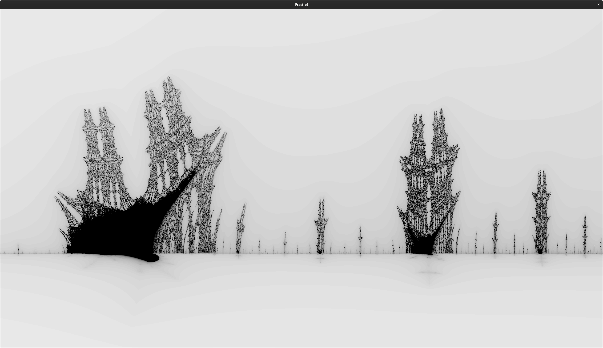
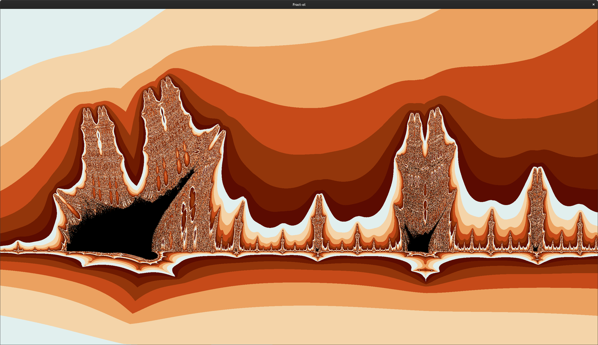
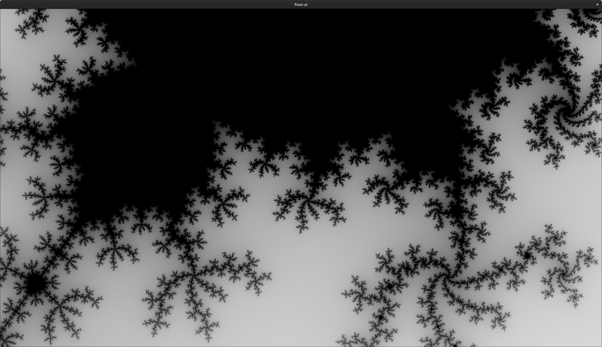

# 02 - fract-ol
## The Project
Create a fractal renderer to display the Mandelbrot and Julia sets, plus one other, with a variety of colouring options, with the ability to pan and zoom on the features of the fractals.

## What I learned
The simple part of this was writing the fractal iteration functions - the [Mandelbrot set](https://en.wikipedia.org/wiki/Mandelbrot_set) and [Julia set](https://en.wikipedia.org/wiki/Julia_set) fractals are closely related, and I chose the [Burning Ship](https://en.wikipedia.org/wiki/Burning_Ship_fractal) fractal as the third option, which only differs slightly from the calculation of the Mandelbrot fractal, and all of these are well documented online in terms of describing the programmatic algorithm for generating the fractal. The key thing was creating a complex number struct and some appropriate helper functions to help simplify the maths in the generator function.

The bigger challenges were working with the required graphics library ([MiniLibX](https://github.com/42Paris/minilibx-linux)), particularly as it is pretty poorly documented by the school, and while there is a [student made documentation site](https://harm-smits.github.io/42docs/libs/minilibx), it far from answers all the questions one might have. Again, working across MacOS and Ubuntu, with the platform implementations of the MLX library being inconsistent in the utilities they provided. Keyboard keycodes were also different.

Those details aside, the main items of note were:
- managing the view window to allow for panning and zooming
- implement colour and shading options better than the basic incremental monocolour shading.

Managing the viewport was a matter of tracking the coordinates of the part of the fractal we wanted to view, use a function to convert from coordinate space to the pixel coordinates of our window, as determined by its resolution and aspect ratio, so that the calculations done in coordinate space could be printed to the window.

The real trick was doing nice colourings.
```c
int	set_color(double depth, t_program *program)
{
	int		palette_size;
	int		color1;
	int		color2;
	double	index;
	double	proportion;

	if (depth == program->iteration_depth)
		return (0);
	if (program->monochrome)
	{
		color1 = 255 * (1 - (depth / (double)program->iteration_depth));
		return (rgb(blue(color1), blue(color1), blue(color1)));
	}
	if (program->color_palette == program->palette.fire)
		palette_size = 7;
	else
		palette_size = 5;
	proportion = modf(depth, &index);
	color1 = program->color_palette[(int)index % palette_size];
	color2 = program->color_palette[((int)index + 1) % palette_size];
	return (linear_interpolation(color1, color2, proportion));
}
```
I ended up having a variety of options, including the ability to set up colour palettes, where you could define a series of colours to move through when shading a fractal, the option for a monochrome gradient, as well the option to make a smooth gradient between iteration depths through a linear interpolation function and an adjustment to the generator functions which allowed them to output fractional iteration depths.

## Gallery
### Rainbow Mandelbrot with smoothing

### Monochrome Burning Ship

### Burning Ship coloured without smoothing

### Monochrome Mandelbrot zoomed
